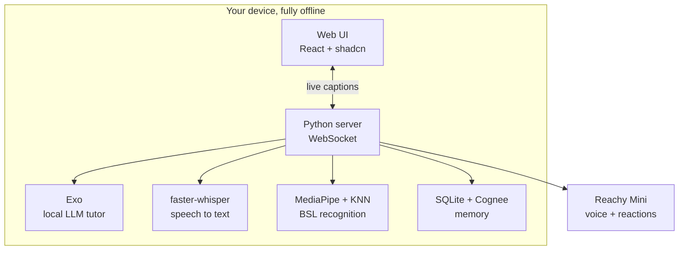
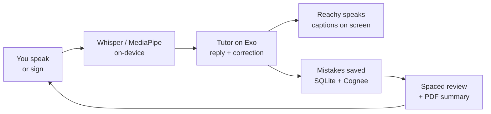

<p align="center">
  
</p>

<h1 align="center">OffBabel</h1>

<p align="center"><b>One tool, two communities. An offline AI language tutor on a Reachy Mini robot.</b></p>

<p align="center">
  
  
  
  
  
</p>

OffBabel teaches a language two ways, and it runs entirely on the device with no internet:

- **Speak**: talk with Reachy in Spanish or English. It replies, corrects your mistakes gently, and keeps the conversation going. You can do it hands-free, no screen needed.
- **Sign**: fingerspell British Sign Language to the webcam. It recognises your letters on-device and Reachy celebrates when you get them.

Everything (speech recognition, the tutor model, sign recognition, memory) runs locally. Your learning data never leaves the device.

## Screenshots

| Home | Speak |
|---|---|
|  |  |
| **Progress** | **Review sheet** |
|  |  |

## How it works



## The learning loop



Each mistake is logged locally and resurfaces later with spaced repetition. At the end of a session you can save a **practice summary as a PDF**.

## How we use the track partners' tech

- **Exo** runs the tutor language model **locally** on the Mac, exposing an OpenAI-compatible endpoint at `:52415`. The whole conversation, replies and grammar corrections, happens on-device. Swapping a cloud API for Exo is a one-line `base_url` change, and we prove it with the network switched off.
- **Cognee** is our memory engine. On top of a SQLite store of every struggled word and sign, Cognee builds a local knowledge graph so it can reason about *what kind* of things a learner finds hard, not just count them, and draw a picture of their memory. It runs offline with a local model and in-process embeddings.
- **Cosine**: we used the Cosine coding agent to help build OffBabel.
- **Reachy Mini (Pollen Robotics)**: the robot is the tutor's voice and presence. It speaks the replies and reacts with head and antenna movement, which makes a screen-free, talk-to-it tutor possible.

## Run it

```bash
# 1. build the web UI (served by the backend)
cd offbabel-ui && npm install && npm run build && cd ..

# 2. install the backend
pip install -r offbabel/requirements.txt

# 3. run it (point the tutor at a local LLM)
#    Mac demo machine: Exo at :52415  ·  dev box: Ollama
OFFBABEL_LLM_URL=http://localhost:11434/v1 OFFBABEL_LLM_MODEL=qwen2.5:3b python -m offbabel.server
# open http://localhost:8500
```

Check any machine is ready with `python -m offbabel.doctor`.

### Sign mode (train it on the demo machine)

```bash
python -m offbabel.sign.capture --letters A,B,G,W --per 60   # record your handshapes
python -m offbabel.sign.train                                # build the classifier
python -m offbabel.sign.live                                 # test it live
```

## Layout

```
offbabel/          backend: server, tutor, sign pipeline, spaced-repetition memory, robot wrapper
offbabel-ui/       the web app (React + Tailwind + shadcn), built to dist/ and served by the backend
speech_to_agent/   standalone Speak spike + the Reachy speaker (robot voice)
docs/              screenshots and notes
```

Built at the Localhost On-Device Agent Hackathon, London.
